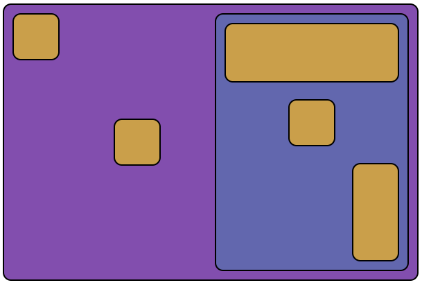

# @4react / flex

Flexbox component for React applications.



```jsx
<Flex row justify="space-between" align="center">
  <Flex self="start" />
  <Flex shrink />
  <Flex column self="stretch" align="center" width={35}>
    <Flex self="stretch" grow />
    <Flex />
    <Flex self="end" grow={4} />
  </Flex>
</Flex>
```

#### Install

```
npm i @4react/flex
```

## Usage
`Flex` component implements all properties of the flexbox standard.
It can be use for both container or flexed items.

```jsx
// usage as container
<Flex row justify="space-between" align="center">
  ...
</Flex>

// usage as flexed item
<Flex>
  ...
  <Flex self="end" grow order={2} />
  ...
</Flex>
```

#### Display
```jsx
// display: flex
<Flex />

// display: inline-flex
<Flex inline />
```

| Prop | Type | Default | Description |
| --- | --- | --- | --- |
| inline | boolean | false | Sets `inline-flex` display property to the element. |

#### Direction

```jsx
// row
<Flex />
<Flex row />
<Flex direction="row" />

// row-reverse
<Flex row reverse />
<Flex direction="row" reverse />

// column
<Flex column />
<Flex direction="column" />

// column-reverse
<Flex column reverse />
<Flex direction="column" reverse />
```

| Prop | Type | Default | Description |
| --- | --- | --- | --- |
| direction | `'row'` `'column'` | `'row'` | Defines the main-axis direction of the container i.e. where the flex items are placed. Corresponding of the `flex-direction` property (along with the `reverse` prop). |
| row | boolean | false | If true, set direction to "row". |
| column | boolean | false | If true, set direction to "column". |
| reverse | boolean | false | Reverse the container direction. |

#### Items disposition

```jsx
// along main axis (justify-content)
<Flex justify="start" />
<Flex justify="center" />
<Flex justify="space-between" />

// along cross axis (align-items)
<Flex align="start" />
<Flex align="stretch" />
<Flex align="center" />
```

| Prop | Type | Default | Description |
| --- | --- | --- | --- |
| justify | `'start'` `'end'` `'center'` `'space-between'` `'space-around'` `'space-evenly'` | `'start'` | Alignment of flex items along the main axis. Corresponding of the `justify-content` property. |
| align | `'stretch'` `'start'` `'end'` `'center'` `'baseline'` | `'stretch'` | Alignment of flex items along the cross axis on the current line. Corresponding of the `align-items` property. |

#### Multiple lines

```jsx
// wrap behavior (flex-wrap)
<Flex /> // nowrap
<Flex wrap /> // wrap
<Flex wrap="reverse" /> // wrap-reverse

// lines disposition (align-content)
<Flex lines="start" />
<Flex lines="center" />
<Flex lines="space-between" />
```

| Prop | Type | Default | Description |
| --- | --- | --- | --- |
| wrap | boolean + `'reverse'` | false | Controls if (and how) items will flow across multiple lines. |
| lines | `'stretch'` `'start'` `'end'` `'space-between'` `'space-around'` `'space-evenly'` | `'stretch'` | Alignment of lines (when there is extra space in the cross-axis). Corresponding of the `align-content` property. |

#### Self alignment

```jsx
// along cross axis of container (align-self)
<Flex self="start" />
<Flex self="stretch" />
<Flex self="center" />
```

| Prop | Type | Default | Description |
| --- | --- | --- | --- |
| self | `'stretch'` `'start'` `'end'` `'center'` `'baseline'` | `'stretch'` | Overrides the container `align` value for the current item. Corresponding of the `align-self` property. |
| order | number | - | Overrides the container `align` value for the current item. Corresponding of the `align-self` property. |

#### Order

```jsx
<Flex order={3} /> // placed as third
<Flex order={1} /> // placed as first
<Flex order={2} /> // placed as second
```

| Prop | Type | Default | Description |
| --- | --- | --- | --- |
| order | number | - | Controls the order in which item appear in the flex container. |

#### Grow and shrink

```jsx
// basis (flex-basis)
<Flex basis={10} />
<Flex basis="50px" />
<Flex basis="auto" />
<Flex basis="content" />

// grow (flex-grow)
<Flex />            // grow = 0
<Flex grow />       // grow = 1
<Flex grow={5} />   // grow = 5

// shrink (flex-shrink)
<Flex />            // grow = 1
<Flex shrink={0} /> // grow = 0
<Flex shrink={5} /> // grow = 5
```

| Prop | Type | Default | Description |
| --- | --- | --- | --- |
| basis | Size + `auto` `content` | - | Defines the default size of the item before the remaining space is distributed. |
| grow | boolean + number | false | Defines the ability for a flex item to grow if necessary. |
| shrink | boolean + number | false | Defines the ability to shrink if necessary. |

#### Sizing and spacing

```jsx
// size
<Flex width={4} />
<Flex width="32px" />
<Flex height={35} />
<Flex height="200px" />

// margin
<Flex margin={1} />
<Flex margin="2px" />
<Flex margin={{ top: 1, x: '20px' }} />
<Flex margin={{ top: 1, left: 4, bottom: 2 }} />

// padding
<Flex padding={1} />
<Flex padding="2px" />
<Flex padding={{ top: 1, x: '20px' }} />
<Flex padding={{ top: 1, left: 4, bottom: 2 }} />
```

| Prop | Type | Default | Description |
| --- | --- | --- | --- |
| width | Size | - | Set the width of the element. |
| height | Size | - | Set the height of the element. |
| margin | BoxValue\<Size\> | - | Set margin values. |
| padding | BoxValue\<Size\> | - | Sets padding values. |

#### Misc

| Prop | Type | Default | Description |
| --- | --- | --- | --- |
| as | string | `div` | Defines a different element to render. |
| className | (see [syntax](../syntax/README.md)) | - | Additional className for the component. |
| style | (see [syntax](../syntax/README.md)) | - | Additional style object for the component. |
